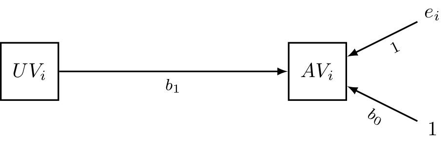
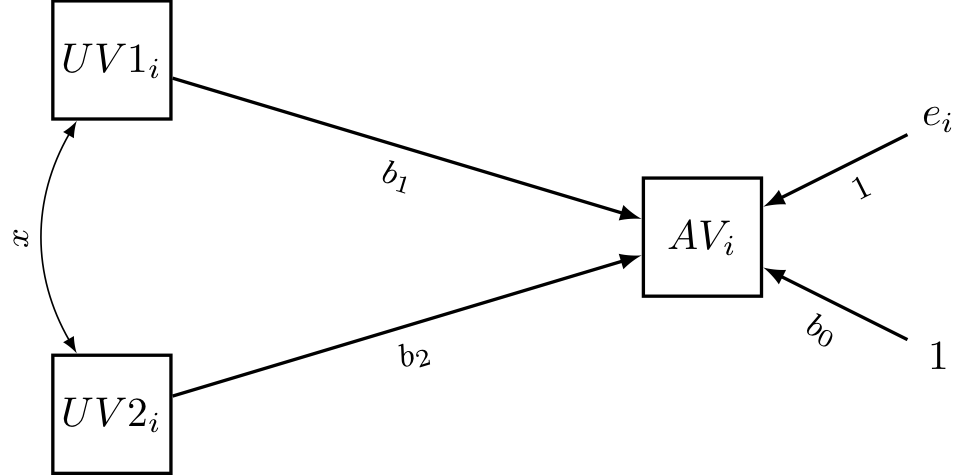
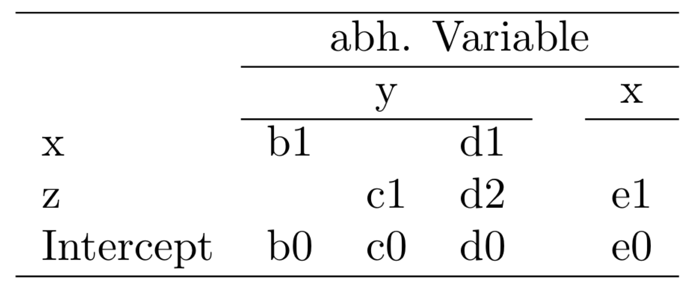

class: hide_logo center middle
<script src="https://kit.fontawesome.com/994a28441d.js" crossorigin="anonymous"></script>
```{r setup, echo=FALSE}
library(rgl)
knitr::knit_hooks$set(webgl = hook_webgl)
```

```{r, echo = F}
library(xaringanthemer)

extra_css <- 
  list(
    ".cit"  = list("font-size" = "70%",
                   "color" = "#8cd000"),
    ".phg" = list("color" = "#8cd000"),
    ".em05" = list("font-size" ="0.5em"),
    ".em06" = list("font-size" ="0.6em"),
    ".em07" = list("font-size" ="0.7em"),
    ".em08" = list("font-size" ="0.8em"),
    ".em09" = list("font-size" ="0.9em"),
    ".em11" = list("font-size" ="1.1em"),
    ".em12" = list("font-size" ="1.2em"),
    ".em13" = list("font-size" ="1.3em"),
    ".em14" = list("font-size" ="1.4em"),
    ".em15" = list("font-size" ="1.5em"))

style_mono_accent_inverse(
  base_color = "#8cd000",
  white_color = "#FFFFFF",
  black_color = "#272822",
  extra_css = extra_css)

library(xaringanExtra)
use_logo(
  image_url = "https://apps.samuel-merk.de/data/PHK_2018_Logo_V1_FARBE_NUR_PH.svg",
  width = "80px",
  position = xaringanExtra::css_position(top = "1em", right = "1em")
)

```


# Universaltool Regression
  
```{r, echo=FALSE, fig.align='center', out.width="40%", message=FALSE, fig.height=3, fig.width=4}
library(hrbrthemes)
library(tidyverse)
ggplot(mtcars, aes(-mpg, wt)) +
  geom_point(color = "#8cd000") +
  stat_smooth(method = "lm", color = "#8cd000") +
  theme_modern_rc() +
  theme(axis.line=element_blank(),axis.text.x=element_blank(),
          axis.text.y=element_blank(),axis.ticks=element_blank(),
          axis.title.x=element_blank(),
          axis.title.y=element_blank())
```

### Ein GRAPH Workshop von Samuel Merk - PH Karlsruhe

---  
`r typed::typed(c("Hallo und 💚lich Willkommen!", "Alle Materialen - auch diese Folien - findet ihr auf moodle.", "unter https://bit.ly/merk014 ...", "Ihre Zugangsdaten wurden Ihnen automatisert zugeschickt."), typeSpeed = 80, backSpeed = 20, backDelay = 3000, loop = T, contentType = "html")` 

---
## Mein Plan für heute:
* Organisation des Workshops
* Vorstellungsrunde
* Inferenzstatistik, Effektstärken, Statistische Modelle
* Einführung »Einfache lineare Regression«
    * Parametrisierung
    * Parameterschätzung
    * Parameterinterpretation
    * Effektstärken $\beta_1$ und $R^2$
* Übung Regression    
* Einführung »Multiple lineare Regression«    
    * Parametrisierung
    * Parameterschätzung
    * Parameterinterpretation
    * Effektstärken $\beta_i\; (\forall i \in \mathbb{N}\; mit\; n ≥ 1)$ und $R^2$
* Übung »Multiple lineare Regression«  

---
## Vorstellungsrunde

--
### Ich interessiere mich u.a. für
.em15[
* eure inhaltliche Ausrichtung der Diss.
* Stand eurer Diss.
* eure Vorerfahrung mit Regression
* euer Spezialinteresse an Regression (z.B. Moderation, binäre AV, ordinale AV, Multi-Level, ...)
* eure Standardsoftware
* eure Wunschsoftware
]


---
class: center, middle
# Inferenzstatistik - Effektstärken -<br>Statistische Modelle    

---
# Beispiel zum Einstieg I
> Der folgende Ausschnitt einer (abgeänderten) Pressemitteilung, bezieht sich auf eine reale Studie, die untersuchte, inwiefern sich bei Neuntklässlerinnen und Neuntklässlern die Wertschätzung des Faches Mathematik durch eine Präsentation von Interviews steigern lässt. Dazu wurde zunächst bei einer repräsentativen Stichprobe von Schülerinnen und Schülern die Wertschätzung des Faches Mathematik per Fragebogen erfasst und ihnen dann Interviewausschnitte präsentiert, in denen Berufstätige aussagen, dass Mathematik eine große Bedeutsamkeit für ihre Tätigkeit hat. Anschließend wurde die Wertschätzung des Faches Mathematik nochmals erfasst. _Nach der Präsentation der Interviews zeigten 75% der Schülerinnen und Schüler eine Wertschätzung über dem Durchschnitt der Wertschätzung vor der Präsentation._

&nbsp;<br>&nbsp;<br>
Was denken Sie? Soll Ausschnitt _»zeigten 75% der Schülerinnen und Schüler eine Wertschätzung über dem Durchschnitt der Wertschätzung vor der Präsentation«_ beschreiben
* wie sicher es ist, dass der Unterschied auch tatsächlich existiert oder 
* wie groß der Unterschied ist?


---
# Beispiel zum Einstieg II
> ... _Die Präsentation von Interviewausschnitten zeigte einen signifikanten Effekt auf die Wertschätzung des Faches Mathematik._

&nbsp;<br>&nbsp;<br>
Was denken Sie? Soll diese Formulierung beschreiben
* wie sicher es ist, dass der Unterschied auch tatsächlich existiert oder 
* wie groß der Unterschied ist?

---
# Beispiel zum Einstieg III
> ... _Die erhobenen Daten sind unter der Annahme gleicher Wertschätzung des Faches vor und nach der Präsentation der Interviews sehr unwahrscheinlich._

&nbsp;<br>&nbsp;<br>
Was denken Sie? Soll diese Formulierung beschreiben
* wie sicher es ist, dass der Unterschied auch tatsächlich existiert oder 
* wie groß der Unterschied ist?

---
# Effektstärken & Inferenzstatistiken

### Effektstärken
* Definition: _»We define effect size as a quantitative reflection of the magnitude of some phenomenon that is used for the purpose of addressing a question of interest«_ (Kelly & Preacher, 2012). 
* Ideale Eigenschaften einer Effektstärke nach Cohen (1988)
     1. Dimensionslosigkeit
     2. Unabhängigkeit von der Maßeinheit der Ursprungsdaten
     3. Unabhängigkeit von der Stichprobengröße

### Inferenzstatistiken
* Definition: Während deskriptive Statistik Datensätze beschreibt widmet, sich die Inferenzstatistik der Frage, _»mit welcher Sicherheit sich Ergebnisse, die an der untersuchten Stichprobe gewonnen wurden, auf die Grundgesamtheit (Population) verallgemeinern lassen.«_ (Eid, Gollwitzer & Schmidt, 2013)
* Voraussetzungen eines technischen Verständnisses sind Maßtheorie & Stochastik (mathematische Wahrscheinlichkeitstheorie) $\Rightarrow$ wir beschäftigen uns »nur« konzeptionell mit Inferenzstatistiken.


---
class: center, middle
# Einfache lineare Regression

---
## Bsp: Lernstunden vs. Lernerfolg
```{r,echo = F, fig.height=6, fig.width=4, out.width="74%", fig.align='center', message=FALSE, warning=FALSE}
library(tidyverse)
library(plotly)
# Beispieldatensatz aus Ergänzungsliteratur
klausur_data <- tibble(Vorbereitungsaufwand = c(18,26,46,42,20,26,38,34,40,30,24,14,44,10,28,28,36,16,50,24,36,32,34,22,32),
                       Punkte = c(21,22,37,30,19,25,32,32,30,22,26,19,29,13,27,21,25,16,33,17,28,23,26,23,29))                
ggplotly(
  ggplot(klausur_data, aes(x = Vorbereitungsaufwand, y = Punkte)) + 
    geom_point(color = "#8cd000") + 
    stat_smooth(method = "lm", se = F, color = "#8cd000") +
    labs(title = "Vorbereitungsaufwand & Klausurpunkte", subtitle = "Daten aus Eid, Gollwitzer und Schmitt (2015)") + 
    theme_modern_rc()
)
```

---
## Parametrisierung
* Darstellung als Formel (Term)
     * $y_i = b_0 + b_1 \cdot x_i + \epsilon_i$
     * $Punkte_i = 10 + 0,5 \cdot Vorbereitungsaufwand_i + \epsilon_i$

* Darstellung als Pfadmodell  
```{r, echo = F, out.width="30%"}

```

---
class: center middle
## Parameterschätzung

---
## Parameterschätzung
<iframe scrolling="no"
src="https://www.geogebra.org/material/iframe/id/wDpDdS7g/width/1600/height/715/border/888888/rc/false/ai/false/sdz/false/smb/false/stb/false/stbh/true/ld/false/sri/false"
width="1000px"
height="415px"
style="border:0px;" allowfullscreen>
</iframe>

---
class: center middle
## Parameterinterpretation

---
## Take Home Message 1: Korrelation $\neq$ Causation
```{r, echo = F, message=FALSE, warning=FALSE, out.width="58%", fig.align='center', fig.width=6, fig.height=4, dev="svg"}
library(hrbrthemes)
library(tidyverse)
library(ggrepel)
ggplot(#nobel_chocolate, 
       read.csv("data/nobel-chocolate.csv")%>%
         mutate(Country_Ger = ifelse(Country == "Germany", "Germany", NA)),
  aes(Chocolate, Laureates10_million, label = Country_Ger)) +
  geom_point(color = "#8cd000") +
  stat_smooth(method = "lm", se = F, color = "#8cd000") +
  theme_modern_rc() + 
  labs(title = "Nobelpreise und Schokoladenkonsum",
       caption = "Idee und Daten von F. Dablander (2019)",
      y = "Nobelpreise je 10 Millionen Einwohner",
      x = "Schokoladen Konsum") +
  geom_label_repel(size = 2.3, xlim = 6.2, color = "#ffffff", fill = "#8cd000")
```

---
## Take Home Message 2: Check your Model!
<iframe src="https://samuel-merk.de/check-your-linear-model" allowfullscreen="" mozallowfullscreen="" webkitallowfullscreen="" width="1000px"
height="490px" style="border:0px;" ></iframe>

---
class: center middle
## Effektstärken $\beta_1$ und $R^2$ 

---
## Effektstärke $\beta_1$
<iframe scrolling="no"
src="https://www.geogebra.org/material/iframe/id/mR3kx7Fm/width/3000/height/1500/rc/false" width=1200px" height="450px" style="border:0px;" allowfullscreen>
</iframe>

---
## Effektstärke $R^2$
<iframe scrolling="no"
src="https://www.geogebra.org/material/iframe/id/nden8mar/width/2200/height/900/" width="1200px" height="450px" style="border:0px;" allowfullscreen>
</iframe>

---
class: middle center
# Übung: Einfache lineare Regression

---
## Übung: Einfache lineare Regression
.em14[
* Für <i class="fab fa-r-project" style="color:#8cd000"></i>-Nutzer\*innen: [Interaktives Tutorial <i class="fas fa-external-link-square-alt" style="color:#8cd000"></i>]https://apps.samuel-merk.de/tutorial-reg-korr/) 
* Alle anderen können die Datensätze dort herunterladen und dann lokal in SPSS/JASP/jamovi bearbeiten.
* `r xfun::embed_file("data/klausur_data_m.sav", "klausur_data_m.sav", text = "Hier")` findet man außerdem den Klausurergebnis-Vorbereitungsaufwand-Datensatz als .sav-Datei.
* Auf moodle gibt es parametrisierte Aufgaben (bei wiederholtem Üben kommen neue Abbildungen/Datensätze/etc.)]

---
class: center, middle
# Multiple lineare Regression

---
## Multiple Regression
* Darstellung als Formel (Term)
     * $y_i = b_0 + b_1 \cdot x1_i + b_2 \cdot x2_i + \dots + b_j \cdot xj_i + \epsilon_i$
     * $Punkte_i = -0,13 + 0,52 \cdot Vorbereitungsaufwand_i + 0,38 \cdot Nervositaet_i + \epsilon_i$
* Darstellung als Pfadmodell  
```{r, echo = F, out.width="20%"}

```
    
---
## Multiple Regression
* Darstellung als Schaubild  

```{r, echo = F, fig.height=4, message=F, out.height= "500px", warning=FALSE, eval=FALSE}
library(tidyverse)
library(plotly)
klausur_data_m <- tibble(Vorbereitungsaufwand = c(34,29,20,35,45,29,46,49,21,36,42,23,12,28,33,25,47,
                                                17,31,31,21,24,22,26,40,37,33,12,22,31,28,15,28,27,
                                                25,13,25,28,11,50,31,40,11,11,38,39,50,22,37,11),
                       Pruefungsangst = c(4,4,5,10,7,6,6,3,1,9,7,7,6,1,1,3,6,3,9,2,8,3,2,6,9,8,8,1,1,
                                       3,4,4,9,2,9,5,3,8,9,1,1,1,10,9,4,4,8,1,10,8),
                       Punkte = c(23,10,11,19,25,16,24,29,20,21,31,20,11,12,13,13,24,7,19,4,8,16,
                                  11,8,26,21,27,7,15,14,22,10,19,14,17,16,15,16,11,30,12,20,8,8,
                                  24,21,31,12,19,5))               

library(reshape2)
lm_mod <- lm(Punkte ~ Vorbereitungsaufwand + Pruefungsangst,data =klausur_data_m)

#Graph Resolution (more important for more complex shapes)
graph_reso <- 0.05

#Setup Axis
axis_x <- seq(min(klausur_data_m$Vorbereitungsaufwand), max(klausur_data_m$Vorbereitungsaufwand), by = graph_reso)
axis_y <- seq(min(klausur_data_m$Pruefungsangst), max(klausur_data_m$Pruefungsangst), by = graph_reso)

#Sample points
Regressionsebene <- expand.grid(Vorbereitungsaufwand = axis_x,Pruefungsangst = axis_y,KEEP.OUT.ATTRS = F)
Regressionsebene$Punkte <- predict.lm(lm_mod, newdata = Regressionsebene)
Regressionsebene <- acast(Regressionsebene, Pruefungsangst ~ Vorbereitungsaufwand, value.var = "Punkte") #y ~ x

klausur_plotly <- 
  plot_ly(klausur_data_m
       )%>%
  add_trace( x = ~Vorbereitungsaufwand, 
        y = ~Pruefungsangst, 
        z = ~Punkte,
        type = "scatter3d", 
        mode = "markers",
        marker = list(size = 2, color = "#37414b", symbol = 104))%>%
  add_surface(z = ~Regressionsebene,
              x = ~axis_x,
              y = ~axis_y,
              opacity = 0.8,
              colorscale = list("#a51e41"),
              contours = list(x = list(highlight = F),
                              y = list(highlight = F),
                              z = list(highlight = F)))%>%
  #add_trace(x = c(5,10), y = c(5,10), z = c(5,10), type = "scatter3d",  mode="lines",
  #          line = list(color = "#a51e41", width = 4))%>%
 layout(scene = list(xaxis = list(spikesides = T, showspikes = T),
                     yaxis = list(spikesides = T, showspikes = T),
                     zaxis = list(spikesides = T, showspikes = T)),
        showlegend = F)

htmlwidgets::saveWidget(klausur_plotly, "img/klausur_plotly/klausur_plotly.html")

```


<iframe src="img/klausur_plotly/klausur_plotly.html" width="700" height="400px" data-external="1"></iframe>


---
## Konfundierung, Suppression und Simpsons Paradox
### Definition Konfundierung
Wenn die folgenden beiden Regressionsmodelle gegeben sind,  
$$ AV_i = b_0 + b_1 \cdot UV1_i + \epsilon_i$$
$$ AV_i = c_0 + c_1 \cdot UV1_i + c_2 \cdot UV2_i + \epsilon_i$$

und eine kausale Konfundierung vorliegt, findet man $|b_1| > |c_1|$ _(die prädiktive Kraft von $UV1$ __sinkt__ unter Hinzunahme einer weiteren UV;_ @MacKinnon2000a). Dies kann nur dann eintreten, wenn $UV_1$ und $UV_2$ miteinander korreliert sind. Konfundierungen erkennt man also nur, wenn man die Parameter der einfachen __und__ der multiple Regression betrachtet und deren Koeffizienten vergleicht.

---
### Beispiel Konfundierung
Im berühmten Klassengrößen-Experiment "STAR" wurde neben den Effekten kleinerer Klassen und zusätzlicher Lehrkräfte auch die Effekte der Anstrengungsbereitschaft und der Pretestleistung auf die Posttestleistung untersucht, wobei sich folgende Ergebnisse (standardisierter) Regressionen zeigen:
$$Posttest_i = 0.15 + 0.41 \cdot Effort_i + \epsilon_i$$
$$Posttest_i = 0.00 + 0.14 \cdot Effort_i + 0.71 \cdot Pretest_i + \epsilon_i$$
Der Regressionskoeffizient der Variable _Effort_ (Steigungskoeffizient) sinkt also beträchtlich!  

Man kann nun sagen: 

* _"nach Kontrolle der Pretestleistung prädiziert der Effort die Posttestleistung mit  ..."_
* _"der Effekt des Effort auf die Posttestleistung ist durch die Pretestleistung konfundiert"_

---
### Konfundierung anschaulich
```{r echo = F, fig.height=4, message=F, out.height= "300px", warning=FALSE, eval=FALSE}
STAR <- read_delim("https://raw.githubusercontent.com/sammerk/did_data/master/Konfundierung.csv", delim = ",")

Effort <- STAR$Effort
Posttest <- STAR$Posttest
Pretest <- STAR$Pretest

library(reshape2)
library(plotly)
lm_mod <- lm(Posttest ~ Effort + Pretest,data =STAR)

#Graph Resolution (more important for more complex shapes)
graph_reso <- 0.05

#Setup Axis
axis_x <- seq(min(STAR$Effort, na.rm = T), max(STAR$Effort, na.rm = T), by = graph_reso)
axis_y <- seq(min(STAR$Pretest, na.rm = T), max(STAR$Pretest, na.rm = T), by = graph_reso)

#Sample points
Regressionsebene <- expand.grid(Effort = axis_x,Pretest = axis_y,KEEP.OUT.ATTRS = F)
Regressionsebene$Posttest <- predict.lm(lm_mod, newdata = Regressionsebene)
Regressionsebene <- acast(Regressionsebene, Pretest ~ Effort, value.var = "Posttest") #y ~ x


STAR_plotly <- 
  plot_ly(STAR)%>%
  add_trace( x = ~Effort, 
             y = ~Pretest, 
             z = ~Posttest,
             type = "scatter3d", 
             mode = "markers",
             marker = list(size = 2, color = "#37414b", symbol = 104),
             showlegend = FALSE)%>%
  add_surface(z = ~Regressionsebene,
              x = ~axis_x,
              y = ~axis_y,
              opacity = 0.8,
              colorscale = list(list('#a51e41', '#b4a069')),
              contours = list(x = list(highlight = F),
                              y = list(highlight = F),
                              z = list(highlight = F)))%>%
  add_trace(x = c(-3.5,1.5), y = c(-3.8,-3.8), z = c(-1.294,0.766), type = "scatter3d",  mode="lines", name = "Einf. Reg: Posttest ~ Effort",
            line = list(color = "#a51e41", width = 4))%>%
  add_trace(x = c(1.5,1.5), y = c(-3.8,3.6), z = c(-3.0212,2.795874), type = "scatter3d",  mode="lines",name = "Einf. Reg: Posttest ~ Pretest",
            line = list(color = "#b4a069", width = 4))%>%
  layout(scene = list(xaxis = list(spikesides = T, showspikes = T),
                      yaxis = list(spikesides = T, showspikes = T),
                      zaxis = list(spikesides = T, showspikes = T)),
         showlegend = T)

htmlwidgets::saveWidget(STAR_plotly, "img/STAR_plotly/STAR_plotly.html")
```

<iframe src="img/STAR_plotly/STAR_plotly.html" width="700px" height="400px" data-external="1"></iframe>


---
### Definition Suppression
Wenn die folgenden beiden Regressionsmodelle gegeben sind,  
$$ AV_i = b_0 + b_1 \cdot UV1_i + \epsilon_i$$
$$ AV_i = c_0 + c_1 \cdot UV1_i + c_2 \cdot UV2_i + \epsilon_i$$

und Supression vorliegt, dann gilt $|b_1| < |c_1|$ _(prädiktive Kraft von $UV1$ steigt unter Hinzunahme einer weiteren UV)_. Diese kann nur dann eintreten, wenn $UV_1$ und $UV_2$ miteinander korreliert sind. Suppressionseffekte erkennt man nur, wenn man die Parameter der einfachen __und__ der multiple Regression betrachtet und deren Koeffizienten vergleicht.

---
### Beispiel Suppression
In einer Studie zur Assoziation von Bewältigungsstrategien und psychischer Widerstandsfähigkeit [@Yoon2014] zeigte sich zunächst, dass aktives Coping (z.B. aktives Suchen sozialer Unterstützung) mit einem standardisierten Effekt von $.57$ die Widerstandsfähigkeit vorhersagte:
$$Widerstandsfähigkeit_i = b_0 + 0.57 \cdot aktives\;Coping_i + \epsilon_i$$
Nach Aufnahme der Variable "passives Coping" (Nachdenken über Lösungsmöglichkeiten) erhöhte sich die prädiktive Kraft des Prädiktors "aktives Coping":
$$Widerstandsfähigkeit_i = c_0 + 0.99 \cdot aktives\;Coping_i +  c_2 \cdot passives\;Coping_i + \epsilon_i$$

---
### Veranschaulichung Suppression
```{r, echo = F, message = F, warning=FALSE, webgl=TRUE}
library(MASS) # for mvrnorm()
library(rgl)
set.seed(7310383)
mat <- rbind(c(2,.5,.5),
             c(.5,1,-.5),
             c(.5,-.5,1))
dat <- data.frame(mvrnorm(n=130, mu=numeric(3), empirical=T, Sigma=mat))
names(dat) <- c("y","x","z")


x1 <- dat[,2]
x2 <- dat[,3]
y  <- dat[,1]

plot3d(x1,x2,y)

fit1 <- lm(y ~ x1 + x2)

plot3d(x1,x2,y)

coefs <- coef(fit1)
a <- coefs["x1"]
b <- coefs["x2"]
c <- -1
d <- coefs["(Intercept)"]
planes3d(a, b, c, d, alpha=0.5)

## Single Reggerade x1
fit2 <- lm(y~x1)
coef2 <- coef(fit2)

abclines3d(0,0,coef2["(Intercept)"],   1,0,coef2["x1"])

## Single Reggerade x2
fit3 <- lm(y~x2)
coef3 <- coef(fit3)

abclines3d(0,0,coef3["(Intercept)"],   0,1,coef3["x2"])

grid3d(c("x", "y+", "z"))
rglwidget()
```

---
### Definition Simpsons Paradox
Von einem __Simpson' Paradox__ spricht man, _wenn sich das Vorzeichen eines Steigungskoeffizienten einer einfachen linearen Regression nach Hinzunahme eines weiteren Prädiktors ändert_.

---
### Beispiel Simpsons Paradox
```{r, message=F, warning=FALSE}
library(mosaic) # enthält die Daten (U.S. Department of Education aus dem Jahr 1997)
# sat = Scholastic Assessment Test =~ "Studierfähigkeitstest""
# frac = Anteil der Schüler*innen die sich dem Test unterziehen
lm(scale(sat) ~ scale(salary), data = SAT) 
lm(scale(sat) ~ scale(salary) + scale(frac), data = SAT) 
```

---
### Veranschaulichung Simpsons Paradox
```{r, echo = F, warning=FALSE, webgl=TRUE, fig.align='center'}
library(rgl)
salary <- SAT$salary
frac <- SAT$frac
sat <- SAT$sat

#plot3d(salary,frac,sat)

fits1 <- lm(sat ~ salary + frac)

plot3d(salary, frac,sat)

coefs <- coef(fits1)
a <- coefs["salary"]
b <- coefs["frac"]
c <- -1
d <- coefs["(Intercept)"]
planes3d(a, b, c, d, alpha=0.5)

## Single Reggerade x1
fits2 <- lm(sat~salary)
coef2 <- coef(fits2)

abclines3d(0,2,coef2["(Intercept)"],   1,0,coef2["salary"])

## Single Reggerade x2
fits3 <- lm(sat~frac)
coef3 <- coef(fits3)

abclines3d(25,0,coef3["(Intercept)"],   0,1,coef3["frac"])

grid3d(c("x", "y+", "z"))
rglwidget()
```

---
### Typische Regressionstabellen
Würden wiss. Artikel die Ergebnisse von Regressionen als Terme präsentieren wären dies recht unübersichtlich und es würde wohl reichlich kognitive Kapazitäten binden, Konfounder etc. zu suchen. Daher hat sich eine tabellarische Darstellung durchgesetzt:
$$y_i = b_0 + b_1 \cdot x_i + \epsilon_i$$
$$y_i = c_0 + c_1 \cdot z_i + \epsilon'_i$$
$$y_i = d_0 + d_1 \cdot x_i + d_2 \cdot z_i + \epsilon''_i$$
$$x_i = e_0 + e_1 \cdot z_i + \epsilon'''_i$$
  
  
```{r, out.width="30%", echo = F, fig.align="centered"}

```

---
class: middle center
# Übung: Multiple lineare Regression

---
## Übung: Multiple lineare Regression
.em14[
* Für <i class="fab fa-r-project" style="color:#8cd000"></i>-Nutzer\*innen: [Interaktives Tutorial](https://apps.samuel-merk.de/tutorial-multiple-regression/) <i class="fas fa-external-link-square-alt" style="color:#8cd000"></i>
* Alle anderen können die Datensätze dort herunterladen und dann lokal in SPSS/JASP/jamovi bearbeiten.
* Auf moodle gibt es parametrisierte Aufgaben (bei wiederholtem Üben kommen neue Abbildungen/Datensätze/etc.)]
